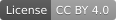

# 小安 知识库

> Open regulatory knowledge base for medical device compliance — EU MDR, FDA, NMPA regulations, standards, and guidance documents.

---

## 简介 / Introduction

**中文** | [English](#english)

本仓库是一个开放的医疗器械合规知识库，收录全球主要法规体系（EU MDR、FDA、NMPA）下的法规文本、适用标准、指南文件及解读内容。

### 内容范围

| 目录 | 内容 | 语言 |
|------|------|------|
| `eu_mdr/` | EU MDR/IVDR 法规、协调标准、MDCG 指南、TEAM-NB 立场文件 | EN / ZH |
| `fda/` | FDA 法规、FDA 认可共识标准（AAMI/ASTM 等）、指南文件 | EN / ZH |
| `nmpa/` | NMPA 法规、GB/YY 中国标准、指导原则、注册申报要求 | ZH / EN |
| `_shared/` | 国际通用标准（ISO/IEC 等）、跨法规通用内容 | EN / ZH |

### 在线文档

  开发中....

---

